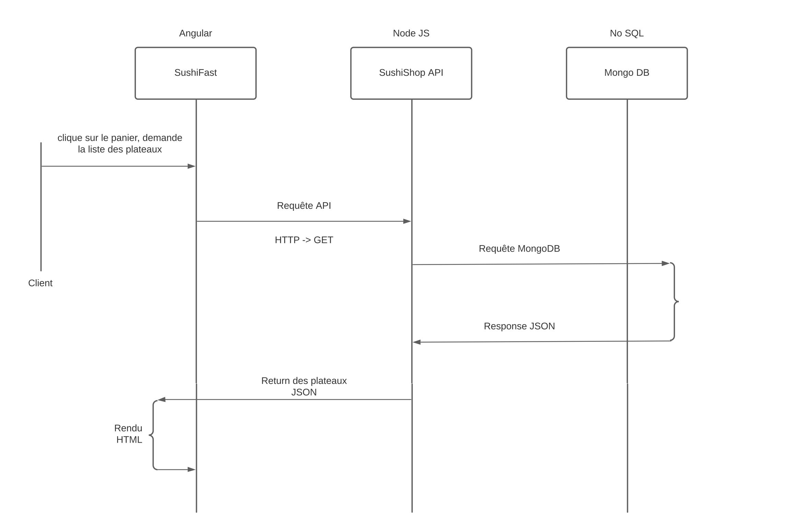
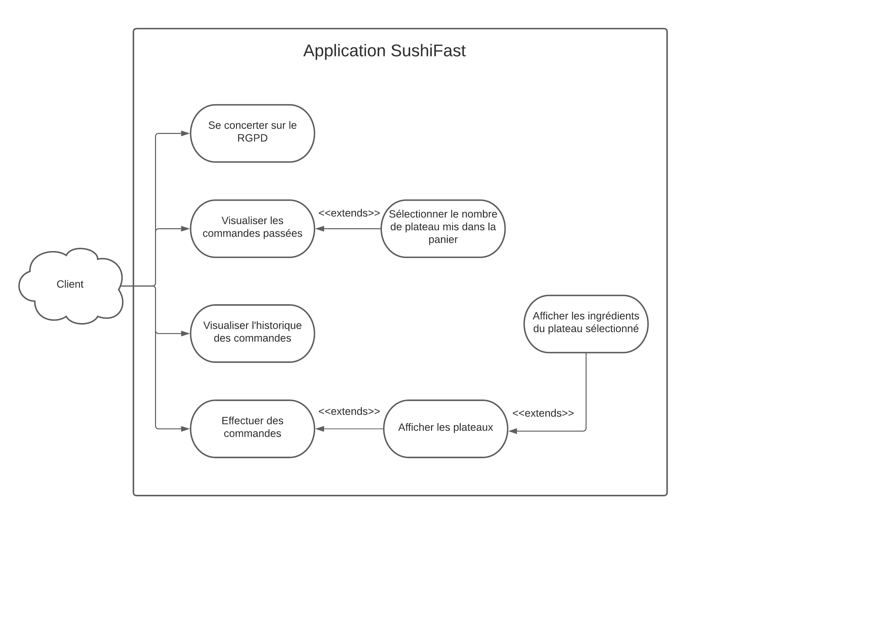

# Application de restauration rapide SushiFast

## Ressources pour le projet

[SushiFast](https://slam-vinci-melun.github.io/sio22/phase2/SP2-Angular-2021_22.pdf)

## Sommaire

* Présentation

* Attendus fonctionnels

    * Affichage de la liste des plateaux de Sushi
    * Possibilité de voir le détail d’un plateau
    * Achat d’un ou plusieurs plateaux sous la forme d’un panier
    * Visualisation des commandes sauvegardées localement
    * Page spécifique concernant la mise en place du RGPD

* Attendus techniques

    * Interrogation d’une API existante via la saisie d’informations dans un formulaire
    * Définition d’une entité objet pour la représentation des données
    * Affichage de la liste des objets, accès au détail, calcul de commande
    * Sauvegarde locale côté client (LocalStorage)
    * Prise en compte d’au moins 2 Evil User Stories
    * Test unitaire (au moins 3)

* Analyse de la demande

* Ce qui est attendu

### Présentation

Cette situation professionnelle repose sur le développement d’une application Front-end avec le framework Angular pour une prise de commande au niveau d’un point de vente.

Deux scénarios peuvent coexister : l’opérateur prend la commande par téléphone pour une livraison à domicile ou le serveur prend une commande pour une consommation sur place.

On comprend bien pourquoi, étant une application interne, il n’existe pas d’authentification pour l’instant.

Elle utilisera par ailleurs une application Back-end dans le cadre d’une API présentant la gamme de produits à la vente. On se base sur les SushiBoxes de l’entreprise SushiShop afin d’approcher le plus une réalité commerciale.

### Attendus fonctionnels

L’application Web aura pour résultat essentiel le calcul d’une commande de plateaux de Sushi.

Elle comportera :

    -> l’affichage de la liste des plateaux de Sushi,
    -> la possibilité de voir le détail d’un plateau,
    -> l’achat d’un ou plusieurs plateaux sous la forme d’un panier,
    -> la visualisation des commandes sauvegardées localement,
    -> une page spécifique concernant la mise en place du RGPD

### Attendus techniques

    1. Interrogation d’une API existante via la saisie d’informations dans un formulaire,
    2. Définition d’une entité objet pour la représentation des données,
    3. Affichage de la liste des objets, accès au détail, calcul de commande,
    4. Sauvegarde locale côté client (LocalStorage),
    5. Prise en compte d’au moins 2 Evil User Stories,
    6. Test unitaire (au moins 3).

### Analyse de la demande

Vous êtes chargé de faire l’analyse initiale du projet. À ce titre vous produirez un diagramme des cas d’utilisation concernant l’application JS cliente ainsi qu’un diagramme présentant les différents tiers participants à la solution (client, serveur...).

La liste des plateaux (ou Boxes) sera composée de données extraites de l’application Back-end SushiAPI, existante mais qui ne fait pas partie du projet. Elle s’utilisera simplement comme une ressource externe. L’utilisateur s’attend à voir, au minimum, le nom du plateau, son image, son prix et son nombre de pièces.

**Note : comme l’information n’existe pas dans l’API, la notation sera aussi absente dans l’application Front- end.**

L’utilisateur après sélection d’un plateau, aura la possibilité d’en voir les détails comme la composition et les saveurs.

**Note : l’image du plateau vous sera fournie (archive Zip) et dans un souci de simplification, elles seront placées dans l’application Front-end (dossier assets).**

Le dossier d’analyse présentera entre autres, les algorithmes mis en œuvre pour obtenir les informations complètes d’un plateau (via des requêtes exploitant SushiAPI, application existante) et décrira la structure (JSON) des objets sauvegardés sur le client.

Toujours dans la présentation de la liste, l’utilisateur aura la possibilité de mettre dans un panier la commande d’un (ou plusieurs) plateau. La technique classique consistera à positionner deux boutons (- et +) ainsi qu’un champ contenant le total des plateaux demandés.

Un menu supplémentaire permettra de voir l’état de la commande courante qui devra manuellement être sauvegardée en local après insertion d’un bouton de validation.

**Note : La communication des commandes au service de préparation ne fait pas partie du périmètre fonctionnel de l’application. Vous avez la possibilité - facultative mais recommandée - d’y ajouter un bouton permettant la suppression d’une commande.**

### Ce qui est attendu

Un rapport de projet de la mission (**présentation datée, analyse, développement front-end, tests, lien vers le dépôt git, conclusion**). L’application devra contenir au moins **3 tests unitaires** et **2 Evil Users Stories**.

Consignes de livraison :

    ● Rapport de projet sous la forme d’un README.adoc de votre projet sur github.com (donc consultable en ligne)
    ● Lors de la remise de votre rapport, vous transmettrez un mail en respectant la forme suivante :

    Objet du mail : SIO22 - Situation professionnelle 2 Destinataire principal : M. Chamillard

Destinataires CC : M.Capuozzo, **autres membres de l’équipe**

    1) Date butoir pour une version provisoire de votre projet : vendredi 10 décembre 2021 - 23 h 59

        Cette partie contiendra obligatoirement :

        -> la date, le nom de l’équipe et les participants au projet,
        -> les différents diagrammes demandés,
        -> des requêtes illustrées sur l’API concernant l’ensemble des plateaux,
        -> le champ d’utilisation du RGPD dans ce projet sachant qu’il sera amené à être plus tard en ligne,
        -> le format de la structure JSON (interface ts) des commandes enregistrées dans le LocalStorage.

    2) Date butoir pour la version finale du projet : vendredi 18 février 2022 - 23 h 59

### Informations du projets

* Date du projet : 2 décembre 2021
* Nom de l'équipe : Les alternants
* Participants au projet : Enzo Carpentier, Kilian Moliere et Corentin Bonifacio

### Les différents diagrammes demandés

### Diagram séquentiel



### Diagram cas d'utilisation


### Les requêtes illustrées sur l'API concernant l'ensemble des plateaux

API du repos :

Fichier : **sushi-shop.service.ts**

```
const apiRest = 'http://127.0.0.1:3000';
```

API de tous les plateaux Nodes JS :

Fichier : **boxes.js**

```
// Retourne tous les plateaux
router.get('/', function (req, res, next) {
  var db = req.db;
  var collection = db.get('boxes');
  collection.find({}, function (e, listeBoxes) {
    res.send(listeBoxes);
  });
});
```

Affichage de tous les plateaux Angular :

Fichier : **sushi-shop.service.ts**

```
getAllsushis(): Observable <any> {
    return this.http.get<any> (apiRest + '/boxes').pipe(
      catchError(this.handleError)
    );
  }
```

### Les requêtes illustrées sur l'API concernant un plateau

API du repos :

Fichier : **sushi-shop.service.ts**

```
const apiRest = 'http://127.0.0.1:3000';
```

API d'un plateau Nodes JS :

Fichier : **boxes.js**

```
// Affichage d'un plateau
router.get('/:id', (req, res) => {
  var db = req.db;
  var collection = db.get('boxes');
  let { id } = req.params;
  collection.find({ "id": parseInt(id) }, function (e, unBoxe) {
    res.send(unBoxe);
  });
});
```

Affichage d'un tableau Angular :

Fichier : **sushi-shop.service.ts**

```
getOnesushi(id : number): Observable<any> {
    return this.http.get<any> (apiRest + '/boxes/' + id)
  }
```

### Champ d'utilisation du RGPD dans le projet

Pour visualiser notre champ d'utilisation du RGPD, référé vous à ce liens ci : 
[RGPD](https://github.com/CorentinSIOdev/SushiFast/blob/main/src/app/component/rgpd/rgpd.component.html)

### Format de la structure JSON des commandes enregistrées dans le LocalStorage
